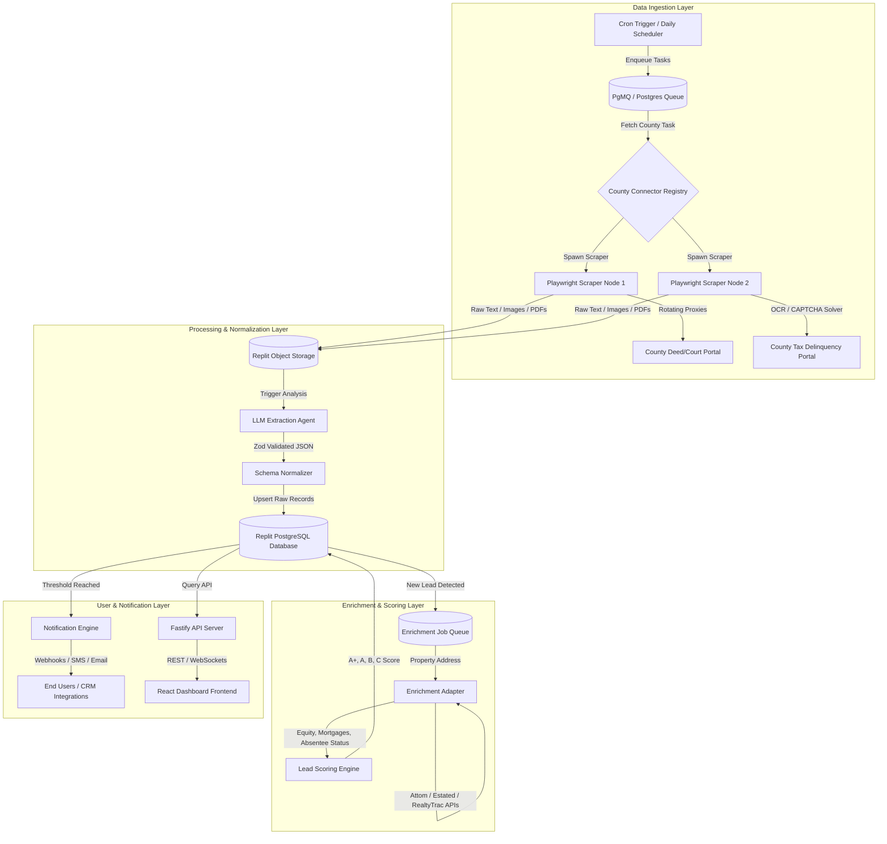
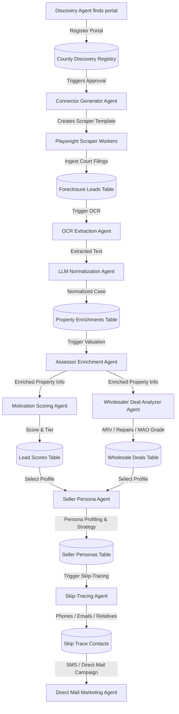
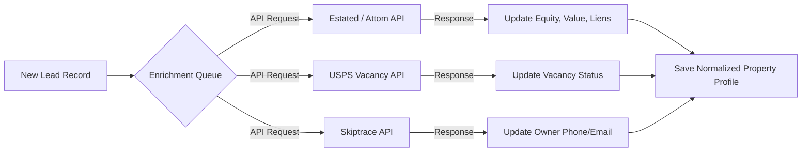

# Architecture & Workflows Design

This document details the system topology, connector framework, AI parsing pipelines, and daily automation workflows for **ForeclosureFinder AI**.

---

## 1. System Architecture Diagram

ForeclosureFinder AI is designed as a distributed, event-driven scraping and processing platform. High-volume scraping workers are isolated from the web server and database to allow independent scaling, self-healing proxy rotations, and queue-based processing.



---

## 2. Workspace & Folder Structure

The repository layout is organized as a monorepo containing decoupled services to optimize scaling on Replit.

```
foreclosure-finder-ai/
├── README.md                          # Workspace entry point
├── package.json                       # Monorepo workspaces and shared configurations
├── docs/                              # System documentation
│   ├── architecture_and_workflows.md
│   ├── database_schema.sql
│   ├── api_specification.md
│   └── operations_and_roadmaps.md
├── services/
│   ├── api-gateway/                   # Web server & Gateway (Fastify)
│   │   ├── package.json
│   │   ├── server.js                  # Gateway entry point
│   │   └── src/
│   │       ├── routes/                # Endpoint controllers
│   │       └── middleware/            # JWT, RBAC, Rate Limiting
│   ├── dashboard/                     # React Single Page App (Vite)
│   │   ├── package.json
│   │   └── src/
│   │       ├── components/            # Interactive Map, CRM Pipeline, Exports
│   │       └── hooks/
│   ├── scrapers/                      # Distributed scraping workers (Crawlee + Playwright)
│   │   ├── package.json
│   │   ├── connector-base.js          # Abstract base connector class
│   │   ├── connectors/                # Concrete county crawler implementations
│   │   │   ├── tn-davidson-deed.js
│   │   │   ├── tx-harris-foreclosure.js
│   │   │   └── fl-miamidade-lispendens.js
│   │   ├── captcha-provider.js        # CAPTCHA solver abstraction layer
│   │   └── worker.js                  # Ingestion runner listening to PgMQ
│   └── workers/                       # Secondary parsing & enrichment workers
│       ├── ocr-processor.js           # PDF & image text extraction
│       ├── ai-parser.js               # LLM normalizer adapter
│       └── enricher.js                # Third-party data integration hooks (Attom/Estated)
└── shared/                            # Shareable code and utilities
    ├── database/                      # Prisma schema and db client config
    └── schemas/                       # Shared Zod schemas (normalization, scoring)
```

---

## 3. County Connector Framework

To support hundreds of county websites with diverse layouts, authentications, and file types, the platform utilizes an object-oriented **County Connector Framework**. All scrapers inherit from an abstract `BaseConnector` class.

### Abstract Base Class (`BaseConnector`)

```javascript
class BaseConnector {
  constructor(countyConfig) {
    this.countyCode = countyConfig.countyCode;         // e.g. "TN_DAVIDSON"
    this.dataSourceType = countyConfig.dataSourceType; // e.g. "HTML_SCRAPE", "API", "FTP", "PDF_OCR"
    this.loginRequired = countyConfig.loginRequired;   // boolean
    this.captchaRequired = countyConfig.captchaRequired; // boolean
    this.ocrRequired = countyConfig.ocrRequired;       // boolean
    this.updateFrequency = countyConfig.updateFrequency; // cron expression
  }

  async login(page) {
    if (!this.loginRequired) return;
    throw new Error("login() must be implemented by subclass.");
  }

  async solveCaptcha(page, siteKey, captchaType) {
    if (!this.captchaRequired) return;
    const provider = process.env.ACTIVE_CAPTCHA_PROVIDER || 'capsolver';
    const captchaSolver = require('./captcha-provider').getProvider(provider);
    return await captchaSolver.solve(page, siteKey, captchaType);
  }

  async executeSearch(page, dateRange) {
    throw new Error("executeSearch() must be implemented by subclass.");
  }

  async extractRecords(page) {
    throw new Error("extractRecords() must be implemented by subclass.");
  }
}
```

### Connector Registry Metadata Structure

Each county registration defines operational parameters to optimize resources and compute:

```json
{
  "TN_DAVIDSON": {
    "name": "Davidson County Deed & Foreclosure Portal",
    "classPath": "./connectors/tn-davidson-deed.js",
    "dataSourceType": "HTML_SCRAPE",
    "filingTypes": ["Lis Pendens", "Notice of Foreclosure", "Deed of Trust"],
    "updateFrequency": "0 2 * * 1-5", 
    "ocrRequired": false,
    "captchaRequired": true,
    "captchaType": "hCaptcha",
    "dataQualityScore": 92
  },
  "LA_ORLEANS": {
    "name": "Orleans Parish Civil District Court Ingest",
    "classPath": "./connectors/la-orleans-court.js",
    "dataSourceType": "PDF_OCR",
    "filingTypes": ["Notice of Seizure", "Petition for Foreclosure"],
    "updateFrequency": "0 4 * * 1-5",
    "ocrRequired": true,
    "captchaRequired": false,
    "dataQualityScore": 85
  }
}
```

---

## 4. Multi-Agent Ingestion & Intelligence Architecture

### 4.1 The 12 Distressed Property Intelligence AI Agents

The Phase 2 platform evolved into a cooperative ecosystem of 12 dedicated AI Agents that orchestrate county discovery, scraper generation, document extraction, deal analytics, and marketing outreach:

1.  **County Discovery Agent**: Continuously crawls recorder/clerk portals nationwide to find and register active database-driven county public record sites.
2.  **Connector Generation Agent**: Generates executable Playwright script connectors automatically from newly discovered county portal metadata.
3.  **OCR Document Extraction Agent**: Performs document scanning and vision-based text extraction on court summonses, deed images, and foreclosure pdf records.
4.  **Natural Language Query (NLP) Agent**: Resolves conversational user prompts into structured filters mapped to SQL query parameters.
5.  **Assessor Valuation Agent**: Communicates with property record systems (e.g. ATTOM API) to pull structural properties and mortgage details.
6.  **Motivation Scoring Agent**: Processes individual owner distress inputs to calculate a dynamic Motivation Score (0-100) and Motivation Tier (LOW/MEDIUM/HIGH).
7.  **Wholesaler Deal Analyzer Agent**: Analyzes property AVMs to calculate ARV, repairs, suggested cash offer, and Maximum Allowable Offer (MAO) grades.
8.  **Seller Demographic Persona Agent**: Heuristically models demographic characteristics to build seller profile cards (e.g. Probate Heir, Out-of-State Landlord) and recommended offer structures.
9.  **Skip-Tracing Contact Agent**: Abstraction layer matching property deeds to verified owner phone lines, email addresses, and close relative contact points.
10. **Geographical Market Heatmap Agent**: Aggregates zip-code level monthly foreclosure/probate volume and cash transactions indices.
11. **Direct Mail Marketing Agent**: Prepares personalized postcard contents and coordinates direct API pipelines to print-on-demand fulfillment centers.
12. **RLS tenant compliance Auditor Agent**: Monitors database transactions to verify Row-Level Security (RLS) tenant isolation, TCPA DNC list regulations, and FCRA disclaimer formatting.

### 4.2 Decentralized Agent Codebase Directory Layout

Each autonomous agent is organized into a modular structure under `services/workers/agents/`:

```
services/
├── workers/
│   ├── agents/
│   │   ├── county-discovery/         # County Discovery Agent (web crawler)
│   │   ├── connector-generator/      # Connector Generation Agent (Playwright template generator)
│   │   ├── document-ocr/             # OCR Extraction Agent (vision text parser)
│   │   ├── nlp-parser/               # NLP Search Query Parser Agent
│   │   ├── assessor-enricher/        # Assessor Valuation Agent
│   │   ├── motivation-scorer/        # Motivation Scoring Agent
│   │   ├── deal-analyzer/            # Wholesaler Deal Analyzer Agent
│   │   ├── seller-persona/           # Seller Demographic Persona Agent
│   │   ├── skip-trace/               # Skip-Tracing Agent
│   │   ├── heatmap-analytics/        # Heatmap Aggregation Agent
│   │   ├── direct-mail/              # Direct Mail Marketing Agent
│   │   └── security-auditor/         # RLS Tenant Security Auditor Agent
```

### 4.3 Multi-Agent Event-Driven Queue Orchestration Flow



### 4.4 LLM Extraction Agent (Entity Extraction)

County record systems often supply raw court pleadings or disorganized tabular printouts. When scrapers download these documents, they are routed to the **OCR Document Extraction Agent** and then the **LLM Extraction Agent** to convert text chunks into normalized JSON files.

#### LLM System Instructions & Schema Definition

The AI extraction uses structured schema enforcement (e.g. OpenAI Structured Outputs or Gemini JSON Schema constraints) mapped to a Zod validation schema:

```javascript
const IngestionLeadSchema = z.object({
  caseNumber: z.string().nullable(),
  filingDate: z.string().regex(/^\d{4}-\d{2}-\d{2}$/), // YYYY-MM-DD
  filingType: z.enum(["LIS_PENDENS", "NOTICE_OF_DEFAULT", "TRUSTEE_SALE", "TAX_DELINQUENCY", "PROBATE", "SHERIFF_SALE"]),
  propertyAddress: z.object({
    street: z.string(),
    city: z.string(),
    state: z.string().length(2),
    zip: z.string().nullable()
  }),
  ownerName: z.string().nullable(),
  mailingAddress: z.object({
    street: z.string().nullable(),
    city: z.string().nullable(),
    state: z.string().length(2).nullable(),
    zip: z.string().nullable()
  }).nullable(),
  loanAmount: z.number().nullable(),
  parcelNumber: z.string().nullable(),
  trusteeName: z.string().nullable(),
  plaintiffAttorney: z.string().nullable(),
  auctionDate: z.string().nullable()
});
```

#### System Ingestion Prompt

```
You are an expert real estate data parser. Analyze the provided court filing, deed records excerpt, or PDF OCR printout and extract the legal entities.

Rules:
1. Extract property details, owner names, case details, and financial obligations exactly as written.
2. If mailing address is not mentioned, set it to NULL.
3. Normalize all dates to 'YYYY-MM-DD'.
4. Format names as "Last Name, First Name" or corporate entity names.
5. If multiple owners exist, extract the primary defendant/owner listed first.
6. Extract monetary values (loan amount, debt) as raw numbers (no commas or currency symbols).
```

---

## 5. daily Ingestion & Ingestion Workflow

```
[01:00 AM] ─ Cron scheduler queries Registry for active Phase 1 counties.
    │
    ├─► Enqueues 1,000+ crawl tasks to PgMQ.
    │
[01:15 AM] ─ Ingestion Worker Pool spawns and pulls tasks.
    │
    ├─► Authenticate with County Portals (Proxy rotating + CAPTCHA handling).
    ├─► Crawl filings matching previous 24 hours.
    ├─► Stream files (PDFs, TIFFs) directly to Replit Object Storage.
    │
[03:00 AM] ─ OCR & AI Processing queue runs.
    │
    ├─► OCR converts images/PDFs to text blocks.
    ├─► AI Extraction Agent converts text to Zod-validated JSON profiles.
    ├─► normalizer upserts into PostgreSQL db (removes duplicate Case Numbers).
    │
[04:30 AM] ─ Ingestion Workflow triggers.
    │
    ├─► Geocode property addresses.
    ├─► Request Property Valuation, Equity, and Tax liens from APIs.
    ├─► Execute Scoring Engine calculations.
    │
[06:00 AM] ─ Notification Engine scans user thresholds and alerts subscribers.
```

---

## 6. Property Enrichment Pipeline

Raw courthouse data does not include equity, vacancy indicators, or phone numbers. The **Enrichment Adapter** is triggered asynchronously for every new unique record:



*   **Valuation Model**: Merges county assessor valuations with automated valuation models (AVMs) to calculate estimated property value.
*   **Equity Formula**:
    $$\text{Estimated Equity} = \text{Estimated AVM Value} - (\text{Court Recorded Mortgage Principal} + \text{Tax Delinquencies})$$

---

## 7. Opportunity Scoring Engine (Lead Scoring Model)

To help investors prioritize leads, every enriched property profile is automatically scored on a scale of **0 to 100** using a weighted multi-factor regression:

$$\text{Opportunity Score} = (0.40 \times S_{\text{equity}}) + (0.25 \times S_{\text{distress}}) + (0.15 \times S_{\text{tenure}}) + (0.10 \times S_{\text{taxes}}) + (0.10 \times S_{\text{vacancy}})$$

### Scored Components

1.  **Equity Score ($S_{\text{equity}}$)**:
    *   $\ge 50\%$ equity = 100 points
    *   $30\% - 49\%$ equity = 75 points
    *   $10\% - 29\%$ equity = 40 points
    *   Negative equity (underwater) = 0 points
2.  **Distress Severity ($S_{\text{distress}}$)**:
    *   Auction Date set / Trustee Sale = 100 points
    *   Lis Pendens / Notice of Default = 80 points
    *   Code Violation / Vacant Property = 50 points
    *   Tax Delinquency only = 30 points
3.  **Ownership Duration ($S_{\text{tenure}}$)**:
    *   $> 15$ years = 100 points
    *   $7 - 15$ years = 75 points
    *   $3 - 6$ years = 40 points
    *   $< 3$ years = 10 points
4.  **Tax Delinquency ($S_{\text{taxes}}$)**:
    *   Multiple years delinquent = 100 points
    *   Single year delinquent = 60 points
    *   No tax delinquency = 0 points
5.  **Vacancy Indicator ($S_{\text{vacancy}}$)**:
    *   USPS vacancy check returned true / Mail undeliverable = 100 points
    *   Owner occupied (tax address matches property address) = 0 points

### Categorization Framework

*   **A+ Lead (Score 85–100)**: Massive equity, high distress severity (e.g. Trustee Sale scheduled), vacant or long tenure. Highly motivated.
*   **A Lead (Score 70–84)**: Moderate to high equity, active Lis Pendens filing, absentee owned.
*   **B Lead (Score 50–69)**: High equity but low distress indicators, or moderate equity with active probate proceedings.
*   **C Lead (Score < 50)**: Little to no equity, early stage tax filings, or recently purchased properties.
